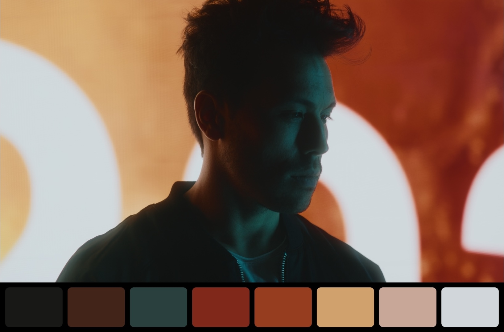

# LSP - Color Palette (OFX)

**Color Palette** is an OFX plug-in for DaVinci Resolve (and other OFX hosts) that extracts a dominant-color palette from an image and composites it with the picture.

**Color extraction** uses **OKLab median cut** on downscaled samples (cross-5 neighborhood average per cell, then median-cut clustering). Heavy work runs on the GPU where possible; **median cut and sort stay on CPU**.

- **Metal (macOS):** GPU downsample → GPU OKLab sample gather → CPU median cut → CPU sort.
- **CUDA / OpenCL:** GPU composite (and downsample where wired); extract gather on CPU slab today.
- **CPU-readable hosts:** CPU downscale + gather → CPU median cut.

**Swatch ordering** (Weight, Lightness, Hue, Saturation, Smooth) uses [OKLAB](https://bottosson.github.io/posts/oklab/) after extract.

**Compositing** uses host GPU buffers when available (**Metal** on macOS, **CUDA** or **OpenCL** on Windows/Linux), with CPU fallback. Extract and composite plans are **cached** across frames when the source fingerprint and parameters are unchanged.



## Platform

- **macOS** 11.0+ (universal arm64 + x86_64 by default)
- **Windows** 64-bit (DaVinci Resolve)
- **Linux** x86-64 (DaVinci Resolve)

Build on each platform separately. Each build writes a **versioned, platform-tagged release folder** containing the `.ofx.bundle`:

| Platform | Release folder (example for v0.1.9) | Inside the bundle |
|----------|-------------------------------------|-------------------|
| macOS | `release/LSP_Color_Palette_0.1.9_macos/` | `Contents/MacOS/<name>.ofx` |
| Windows | `release/LSP_Color_Palette_0.1.9_windows/` | `Contents/Win64/<name>.ofx` |
| Linux | `release/LSP_Color_Palette_0.1.9_linux/` | `Contents/Linux-x86-64/<name>.ofx` |

Pattern: **`LSP_Color_Palette_<version>_<platform>/`**

The bundle inside is always **`LSP_Color_Palette_<version>.ofx.bundle`**.

For GitHub Releases, zip each platform folder separately (or ship all in one archive).

## Build

**CMake** is the only build system.

### Prerequisites

- **CMake** 3.22+
- **macOS:** Xcode Command Line Tools
- **Windows:** Visual Studio 2022 Build Tools (MSVC), **Ninja** (`winget install Ninja-build.Ninja`)
- **Linux:** GCC or Clang, **Ninja** (`sudo apt install ninja-build g++`)

See [tools/README.md](tools/README.md) for optional build helper scripts.

### macOS

```bash
./tools/macos/colorpalette_build.sh
```

Or manually:

```bash
cmake -S . -B build/macos -DCMAKE_BUILD_TYPE=Release
cmake --build build/macos --target colorpalette_all
```

Options at configure time:

- `-DPALETTE_OFX_FAT_ARCHS=OFF` — single-arch build (host CPU only)
- `-DOFX_SDK_PATH=...` — alternate OpenFX SDK checkout

### Windows

```powershell
tools\windows\colorpalette_build.bat
```

Or manually (from a **Developer Command Prompt** or after `vcvars64.bat`):

```powershell
cmake -S . -B build/windows -G Ninja -DCMAKE_BUILD_TYPE=Release -DCMAKE_C_COMPILER=cl -DCMAKE_CXX_COMPILER=cl
cmake --build build/windows --target colorpalette_all
```

### Linux

```bash
./tools/linux/colorpalette_build.sh
```

Or manually:

```bash
cmake -S . -B build/linux -G Ninja -DCMAKE_BUILD_TYPE=Release
cmake --build build/linux --target colorpalette_all
```

**Release snapshot:** `./scripts/archive_version.sh` (macOS) archives the repo, bumps the patch in `VERSION`, prepends `CHANGELOG`, then rebuilds. `CHANGELOG` line 1 must match `VERSION` line 1 before you run it.

## GitHub Actions

This repo includes **Build OFX release** on GitHub Actions. Trigger it manually (**Actions → Build OFX release → Run workflow**). It builds macOS, Windows, and Linux in parallel (three jobs, three artifacts).

## Installation

Copy the bundle from **your platform's output folder** into the host OFX plug-ins directory, then restart DaVinci Resolve.

If the plug-in does not appear after an upgrade, quit Resolve and delete its OFX plug-in cache file (see paths below), then relaunch.

### macOS

Use the bundle inside **`release/LSP_Color_Palette_<version>_macos/`**. Copy it to:

- `/Library/OFX/Plugins/` (all users), or
- `~/Library/OFX/Plugins/` (current user)

**Resolve OFX cache (delete if needed):**  
`~/Library/Application Support/Blackmagic Design/DaVinci Resolve/OFXPluginCacheV2.xml`

### Windows

Use the bundle inside **`release/LSP_Color_Palette_<version>_windows/`**. Copy it to:

`C:\Program Files\Common Files\OFX\Plugins\`

(Elevation required when writing under `Program Files`.)

**Resolve OFX cache (delete if needed):**  
`%APPDATA%\Blackmagic Design\DaVinci Resolve\Support\OFXPluginCacheV2.xml`

### Linux

Use the bundle inside **`release/LSP_Color_Palette_<version>_linux/`**. Copy it to:

`/usr/OFX/Plugins/` (system-wide), or  
`~/.local/share/OFX/Plugins/` (user)

**Resolve OFX cache (delete if needed):**  
`~/.local/share/DaVinciResolve/OFXPluginCacheV2.xml`

## Log file

| Platform | Path |
|----------|------|
| macOS | `~/Library/Application Support/LSP/ColorPalette.log` |
| Windows | `%LOCALAPPDATA%\LSP\Palette.log` |
| Linux | `~/.cache/LSP/ColorPalette.log` |

Use **Open Log** in the plug-in SUPPORT section.

With **`LSP_PALETTE_GPU_STAGE_DEBUG=1`**, the log also records GPU backend choice (`metal_host`, `extract_gpu_gather`, `extract_cache_fast`, cache hits/misses, etc.).

## GPU paths and debugging

| Platform | Composite (overlay) | Palette extract (cache miss) |
|----------|---------------------|----------------------------|
| macOS | Host **Metal** buffers → `LSPPalette.metallib` composite kernel | GPU downsample + GPU OKLab gather; **CPU median cut** |
| Windows | Host **CUDA** (optional **OpenCL**) | CPU gather + median cut from slab (composite on GPU) |
| Linux | **CUDA** if built with `PALETTE_LINUX_CUDA=ON`, else **OpenCL** | Same as Windows |
| CPU-only OFX image | CPU composite fallback | CPU downscale + gather + median cut |

Optional environment variables (read once at load):

| Variable | Effect |
|----------|--------|
| `LSP_PALETTE_GPU_STAGE_DEBUG=1` | Log extract/composite backend and cache stats |
| `LSP_PALETTE_METAL_RENDER_MODE=INTERNAL` | macOS: do not use host Metal for composite |
| `LSP_PALETTE_DISABLE_OPENCL=1` | Skip OpenCL on Windows/Linux |
| `LSP_PALETTE_FORCE_OPENCL=1` | Prefer OpenCL over CUDA when both are built |

Manual QA checklist (CPU vs GPU parity, fallbacks, playback cache): [tools/palette_gpu_parity.md](tools/palette_gpu_parity.md).

## macOS Gatekeeper (unsigned builds)

Release builds are **not signed or notarized**. After you copy the bundle into an OFX folder, macOS may block it from loading in Resolve.

```bash
BUNDLE="/Library/OFX/Plugins/LSP_Color_Palette_0.1.9.ofx.bundle"

sudo chmod -R 755 "$BUNDLE"
sudo chown -R root:wheel "$BUNDLE"
sudo xattr -dr com.apple.quarantine "$BUNDLE"
sudo codesign --force --deep --sign - "$BUNDLE"
```

For a **user-only** install (`~/Library/OFX/Plugins/...`), use that path in `BUNDLE` and skip the `chown root:wheel` line.

Quit Resolve completely, then reopen it.

## Repository layout

```
CMakeLists.txt          # Root build (macOS + Windows + Linux)
cmake/                  # ColorPaletteVersion, ColorPaletteApple, ColorPaletteWindows, ColorPaletteLinux, ColorPaletteCommon
plugin/core/            # OFX plugin, extract/composite, GPU extract dispatch, render cache
plugin/metal/           # LSPPalette.metal (composite + downsample), LSPPaletteExtract.metal (gather)
plugin/cuda/            # Composite kernels (Windows/Linux CUDA builds)
plugin/opencl/          # Composite kernels (embedded .cl source)
common/color/           # Vendored ColorManagement (gamut / transfer decode)
openfx-sdk/             # Vendored minimal OpenFX 1.5.1 + Support layer
tools/                  # Build helpers; palette_gpu_parity.md for GPU QA
```

macOS bundles ship **`Contents/Resources/LSPPalette.metallib`** (composite, downsample, and gather kernels).

Build intermediates: `build/macos/`, `build/windows/`, or `build/linux/`.  
Shippable output: `release/LSP_Color_Palette_<version>_<platform>/`.

## Version

The shipping triplet is on **line 1 of `VERSION`** (also reflected in the generated version header after configure).

## SDK

Vendored minimal OpenFX SDK in `openfx-sdk/`. Override with `-DOFX_SDK_PATH=...` if needed.
